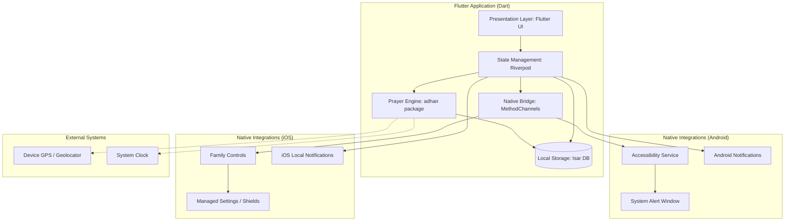

# Architecture: Prayer Screen Time

## High-Level System Diagram

## Layered Architecture Description

### 1. Presentation Layer (Flutter UI)
- **Home Screen**: Real-time prayer countdown and daily timings.
- **Qibla Finder**: Visual compass using `flutter_compass`.
- **App Block Settings**: UI to select and manage the list of "distracting apps".
- **Settings**: Configuration for block durations (before/after prayer).

### 2. Domain & Logic Layer
- **Prayer Engine**: Uses the `adhan` library to calculate times offline based on GPS coordinates.
- **State Management (Riverpod)**: Centralizes the app state, handling the lifecycle of prayer updates and background task orchestration.
- **Location Service**: Wraps `geolocator` to provide coordinates with battery-efficient updates.

### 3. Data Layer
- **Isar Database**: High-performance local storage for:
    - `UserSettings`: Calculation methods, offsets, and location data.
    - `BlockedApp`: Package IDs and metadata for restricted applications.

### 4. Native & Background Layer
- **MethodChannels**: Communicates with platform-specific APIs.
- **Android Native**:
    - `AccessibilityService`: Monitors app foreground state to trigger blocks.
    - `SYSTEM_ALERT_WINDOW`: Renders the "Prayer Focus" overlay.
- **iOS Native**:
    - `FamilyControls`: Requests permission for screen time management.
    - `ManagedSettings`: Applies shields to blocked app tokens.
- **WorkManager**: Ensures daily recalculation of prayer times even when the app is killed.
