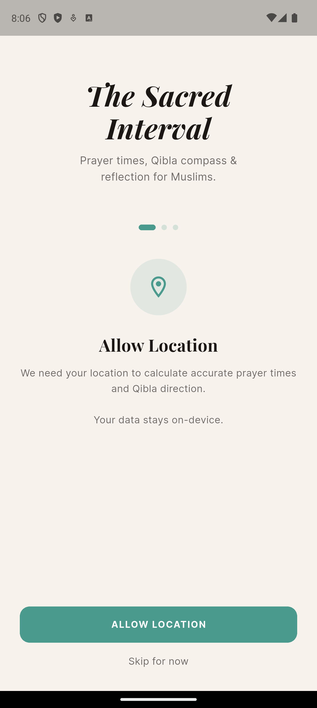
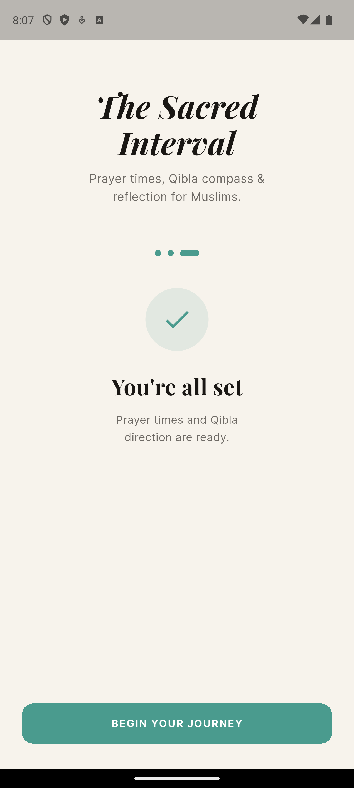
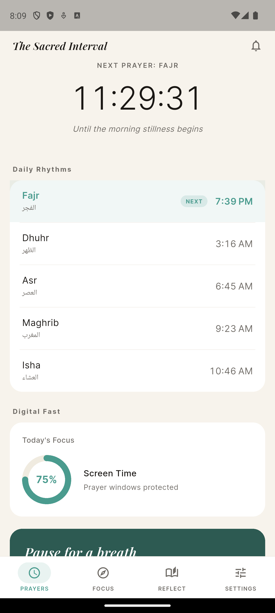
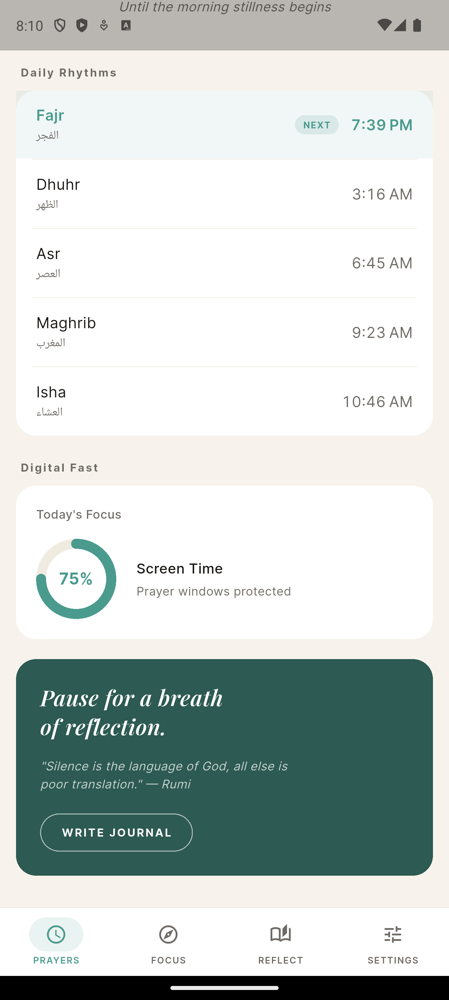
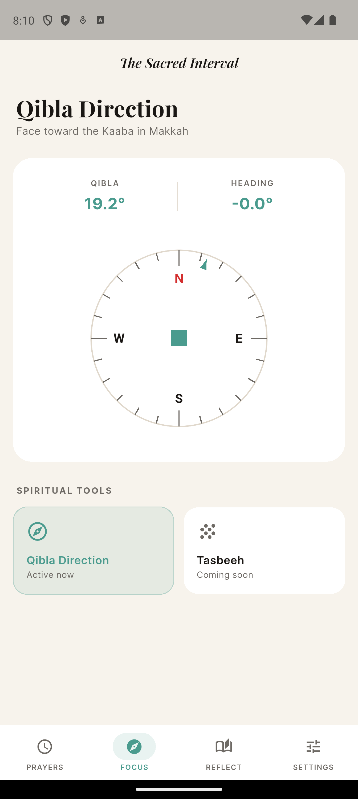
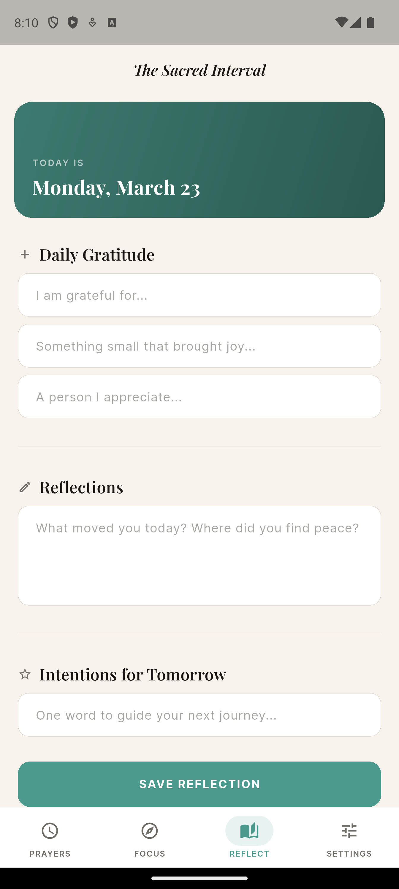
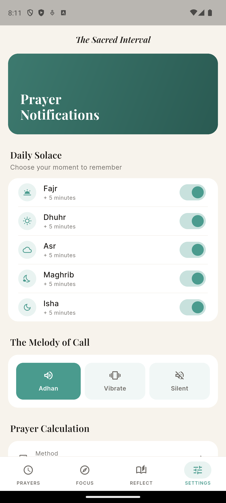
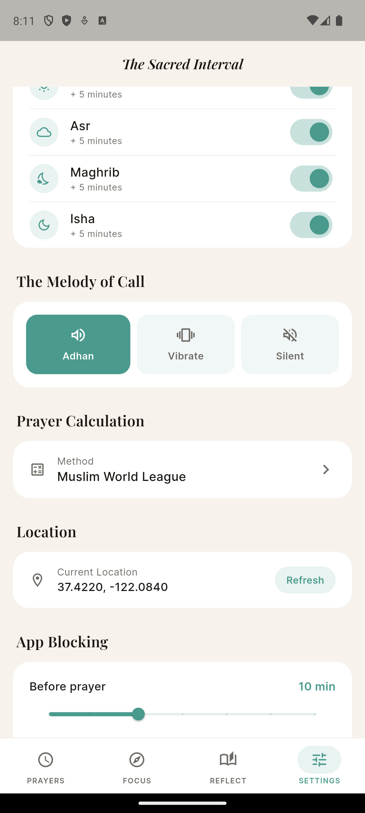

# The Sacred Interval

> *Prayer times, Qibla compass & reflection for Muslims.*

A beautifully designed Flutter app that calculates daily prayer times, sends Adhan notifications, provides a Qibla compass, and helps Muslims build a mindful daily rhythm around their prayers.

---

## Screenshots

<p align="center">
  
  
  
  
  
</p>
<p align="center">
  
  
  
  
</p>

---

## Features

- **Prayer Times** — Offline calculation for any global coordinate using the `adhan` package. Supports 11 calculation methods (Muslim World League, ISNA, Karachi, Umm Al-Qura, and more). Live countdown to the next prayer.
- **Qibla Compass** — Real-time compass needle pointing toward the Kaaba (Mecca) from anywhere in the world. Accuracy within ±3°.
- **Adhan Notifications** — Scheduled local push notifications at each prayer time. Custom per-prayer toggles.
- **App Blocking (Android)** — Select apps to block during prayer windows. Uses `AccessibilityService` to detect foreground apps and show a full-screen overlay.
- **App Blocking (iOS)** — Screen Time API bridge using `FamilyControls` + `ManagedSettings` to shield selected apps *(requires Apple Family Controls entitlement)*.
- **Settings** — Configure calculation method, block duration before/after prayer, notification preferences, and location refresh.

## Tech Stack

| Layer | Technology |
|-------|-----------|
| Framework | Flutter 3.x (Dart) |
| State management | Riverpod 2 |
| Local storage | SharedPreferences |
| Prayer calculation | `adhan` (offline) |
| Location | `geolocator` |
| Compass | `flutter_compass` |
| Notifications | `flutter_local_notifications` |
| Background tasks | `workmanager` |
| Routing | `go_router` |
| Permissions | `permission_handler` |

## Project Structure

```
lib/
├── main.dart               # Entry point — initializes storage, notifications, background worker
├── app.dart                # MaterialApp.router + theme
├── core/
│   ├── constants/          # Colors, strings, prayer method enums
│   ├── database/           # SharedPreferences service + data models
│   ├── location/           # Geolocator wrapper + Riverpod provider
│   ├── permissions/        # Unified permission service
│   ├── router/             # GoRouter config (4-tab shell)
│   └── theme/              # Material 3 theme
├── features/
│   ├── prayer/             # Prayer time calculation + countdown UI
│   ├── qibla/              # Compass + bearing calculation
│   ├── notification/       # Local notifications + background recalculation
│   ├── blocking/           # App blocking (platform bridge + app selection UI)
│   └── settings/           # User preferences
└── shared/widgets/         # AppScaffold (bottom nav)

android/app/src/main/kotlin/.../
├── MainActivity.kt
├── AppBlockerPlugin.kt     # MethodChannel handler
├── AppBlockerService.kt    # AccessibilityService
└── BlockOverlayActivity.kt # Full-screen block overlay

ios/Runner/ScreenTime/
├── ScreenTimePlugin.swift  # MethodChannel bridge
└── ScreenTimeManager.swift # FamilyControls + ManagedSettings
```

## Getting Started

### Prerequisites

- Flutter 3.41+
- Android Studio / Xcode
- Android emulator (API 26+) or physical device
- iOS 16+ device for Screen Time features (simulator won't work)

### Install dependencies

```bash
flutter pub get
```

### Run on Android

```bash
flutter run -d <android-device-id>
```

### Run on iOS

```bash
flutter run -d <ios-device-id>
```

### Run tests

```bash
flutter test
```

## Platform Setup

### Android — App Blocking

The app blocking feature requires the user to grant **Accessibility Service** permission:

1. Open the app → go to the **Blocked Apps** tab
2. Tap the setup wizard to open Android Accessibility Settings
3. Enable "Prayer Screen Time" under Installed Services

Additionally, for battery optimization, guide users to exclude the app from battery restrictions (Settings → Battery → App launch / Battery optimization).

### iOS — Screen Time API

iOS app blocking requires Apple's `FamilyControls` entitlement, which must be requested from Apple:

1. In Xcode, add the **Family Controls** capability to the Runner target
2. Add a `DeviceActivity` extension target
3. Request the `FamilyControls` entitlement from Apple ([request form](https://developer.apple.com/contact/request/family-controls-distribution))
4. Once approved, implement `FamilyActivityPicker` to let users select apps to shield

Until approved, the iOS bridge is implemented and ready — only the entitlement is pending.

## Calculation Methods

| Method | Best For |
|--------|---------|
| Muslim World League | Europe, Far East, Americas |
| Egyptian | Africa, Syria, Lebanon, Malaysia |
| Karachi (UISA) | Pakistan, Afghanistan, India, Bangladesh |
| Umm Al-Qura | Arabian Peninsula |
| Dubai | UAE |
| Qatar | Qatar |
| Kuwait | Kuwait |
| Singapore | Singapore |
| ISNA (North America) | USA, Canada |
| Tehran | Iran, some Shia communities |
| Turkey | Turkey |

## Known Limitations

- **Android OEMs** (Xiaomi, Samsung, Huawei) aggressively kill background processes. Guide users to disable battery optimization and enable autostart.
- **iOS FamilyControls** requires Apple approval — not available in development builds without the entitlement.
- **`flutter_compass`** may be inaccurate on devices without a magnetometer. The app shows a calibration prompt when accuracy is low.
- **Workmanager** on iOS has strict execution time limits (~30 seconds). Heavy recalculation is batched to run within this window.
